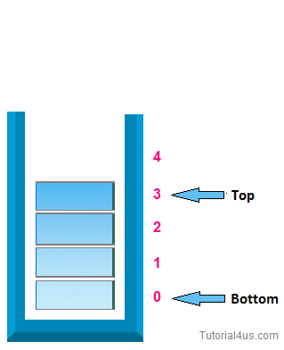

## Stacks

Generally speaking, the Stack is a memory region within the program/process. This part of the memory gets allocated when a process is created. We use Stack for storing temporary data such as local variables of some function, environment variables which helps us to transition between the functions, etc. We interact with the stack using PUSH and POP instructions. As explained in Part 4: Memory Instructions: Load And Store PUSH and POP are aliases to some other memory related instructions rather than real instructions, but we use PUSH and POP for simplicity reasons.

Before we look into a practical example it is import for us to know that the Stack can be implemented in various ways. First, when we say that Stack grows, we mean that an item (32 bits of data) is put on to the Stack. The stack can grow UP (when the stack is implemented in a Descending fashion) or DOWN (when the stack is implemented in a Ascending fashion). The actual location where the next (32 bit) piece of information will be put is defined by the Stack Pointer, or to be precise, the memory address stored in the SP register. Here again, the address could be pointing to the current (last) item in the stack or the next available memory slot for the item. If the SP is currently pointing to the last item in the stack (Full stack implementation) the SP will be decreased (in case of Descending Stack) or increased (in case of Ascending Stack) and only then the item will placed in the Stack. If the SP is currently pointing to the next empty slot in the Stack, the data will be first placed and only then the SP will be decreased (Descending Stack) or increased (Ascending Stack).




```markdown
Sample code block

public static void main (String[] str) {
  System.out.println("Hello World");
}
